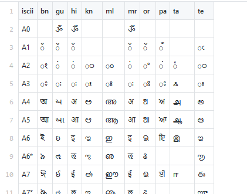
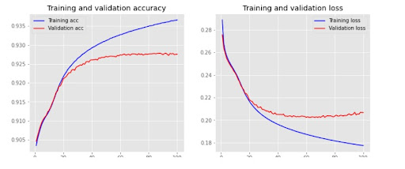
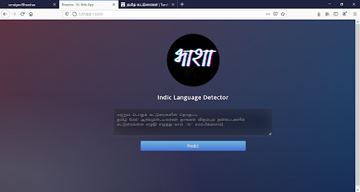
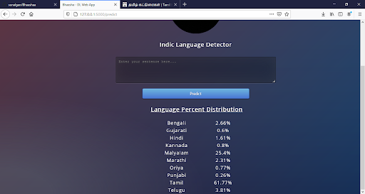

  

# Bhasha Web App: Indic Languages Detection from Text

Bhasha Web App is a deep learning-based web application designed to detect multiple Indian languages from a given text. The model achieves an accuracy rate of over 80% in predicting the language of the provided input text. The training and testing data for the model were sourced from the MultiIndicMT dataset, which encompasses 10 major Indic languages: Bengali, Gujarati, Hindi, Kannada, Malayalam, Marathi, Oriya, Punjabi, Tamil, Telugu, along with English.

## Features and Development

- **Data Encoding:** The web app employs encoding techniques to map the diverse multilingual characters into a more standardized encoding format known as ISCII (Indian Script Code for Information Interchange).
  
- **Model Development:** The initial model's accuracy and loss were analyzed and fine-tuned using various regularization techniques. The model's performance was improved through rigorous testing and refinement.

- **Hyperparameter Tuning:** The final model's performance was further optimized using Azure Hyperdrive, which allowed for fine-tuning the model's hyperparameters to achieve the best results.

## Usage

1. **Web Interface:** Users can input text in mixed Indic languages or even an unknown combination of languages. The web app will display the percentage distribution of Indic languages present in the input text, allowing users to identify the dominant language components.

2. **Dockerized Deployment:** The web app is deployed using Docker containerization technology. This ensures a consistent and reliable deployment process that can be easily replicated across different environments.

## Deployment

The Bhasha Web App is hosted on the Heroku platform using Dockerized containers. This deployment approach offers scalability, flexibility, and ease of management.

## Figures

**Fig. 1:** Encoding of diverse multilingual characters to ISCII encoding format for uniform representation.

  

**Fig. 2:** Initial model accuracy and loss, followed by the implementation of various regularization techniques.

  

**Fig. 3 and 4:** Demonstration of the web app's functionality: inputting unknown mixed Indic language text and receiving the percentage distribution of languages.

  
  

## Contributors

- [Sonal Ganvir](https://github.com/sonalgan)
- [Anurag De](https://github.com/404S-retr0)
## License

This project is licensed under the [MIT License](LICENSE).

Training scripts for the deep learning model can be found in the [DeepLearning](https://github.com/sonalgan/DeepLearning) repository.

Feel free to contribute and collaborate to enhance the accuracy and language coverage of the Bhasha Web App!

